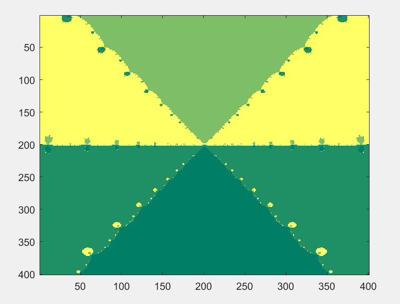
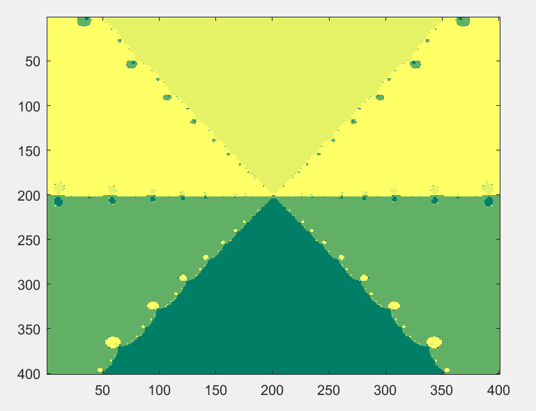
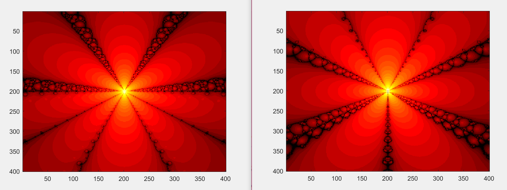
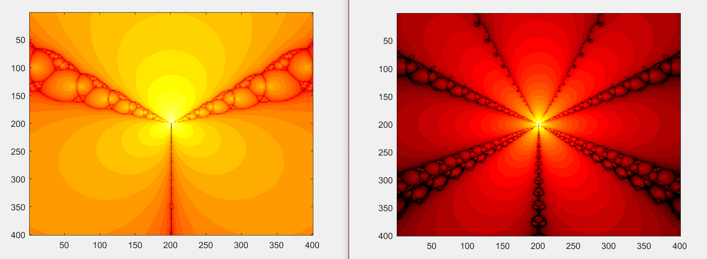
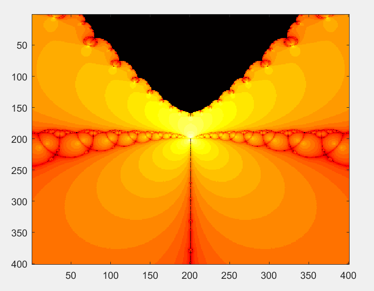
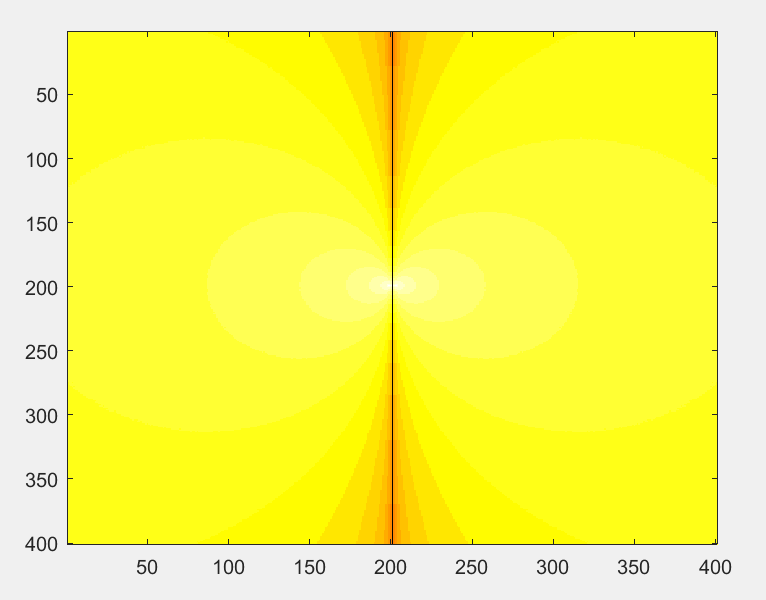
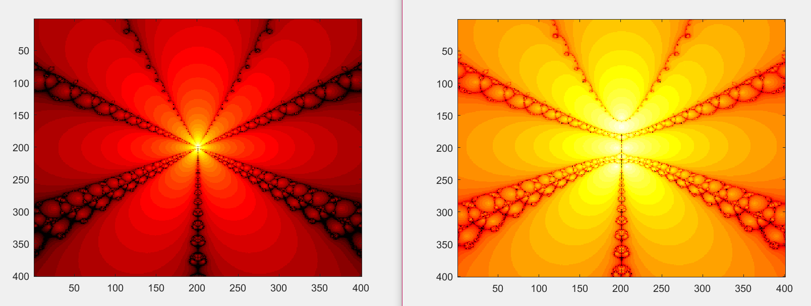
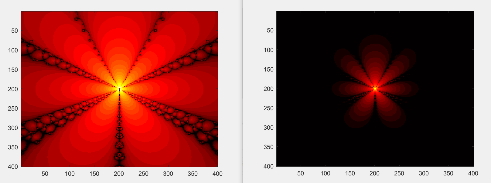
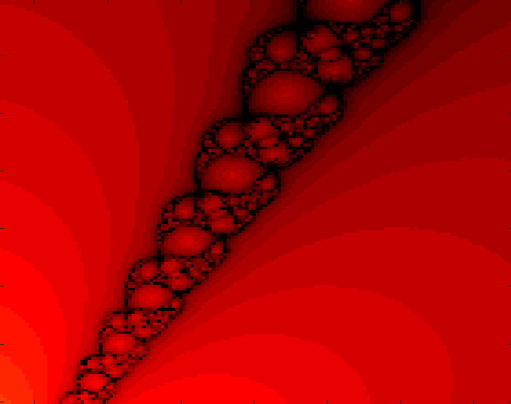

# Newton's method visualization in MATLAB

This project focuses on the visualization of the convergence speed of Newton’s method in the complex domain. The method is applied to finding roots of a polynomial expressed using Chebyshev polynomials:

$w_n(x) = \sum_{k=0}^{n} a_k \bigl(T_k(x) + U_k(x)\bigr)$

where:
- $T_k(x)$ — Chebyshev polynomial of the first kind
- $U_k(x)$ — Chebyshev polynomial of the second kind

It was developed as part of the *Numerical Methods* course at Warsaw University of Technology.

The implementation is written in MATLAB and includes numerical evaluation of the polynomial and its derivative using recurrence relations, without transforming the polynomial into its natural (expanded) form. Newton’s iterative method is then applied for a grid of initial points in the complex plane.

The results are visualized as images illustrating the convergence behavior of the method, including the number of iterations required to reach a root and the attraction regions of individual zeros. The project also contains test scripts and helper functions used to verify correctness and analyze the performance of the algorithm.

## Numerical error analysis

Numerical errors were analyzed by comparing roots obtained using Newton’s method with reference roots computed in Wolfram Alpha. Received errors were visualized using a color scale, where brighter yellow indicates larger errors and darker green represents smaller errors.

The plot on the left shows the matrix of absolute errors in the computed roots, while the one on the right shows relative errors.

   
   

## Interesting examples

Color scale: the darker the color, the greater the number of iterations.

Parameters kept fixed: the number of points in the range, the default error tolerance in Newton’s method.
The maximum number of iterations is set to 40; after this limit is reached, all points are treated identically and displayed in black.

### Example 1

Visualizations for different values of the polynomial coefficients (in both cases, the coefficients are chosen from the interval [0,1], while all other parameters remain the same).

### Example 2

Visualizations for different polynomial degrees: on the left, a third-degree polynomial; on the right, a sixth-degree polynomial. All other parameters are the same in both cases.

### Example 3

The black region at the top of the plot on the left indicates a large number of points in this area for which the method converges slowly. Beyond certain boundary values of x and y, all points reach the iteration limit of 40.

In the center of the plot on the right, a single black line can be observed, indicating that the points lying on it converge slowly compared to the rest. As it turns out, this black line consists of points whose imaginary part is equal to zero, i.e., they are real numbers.

   
   

### Example 4

The plot on the right represents a “zooming in” of the plot on the left toward the center (the point (0,0)). It can be observed that the arms do not converge perfectly in the center of the image.

### Example 5

The plot on the right represents a “zooming out” from the center (the point (0,0)) of the plot on the left. It can be seen that most of the points visible in the plot reach the iteration count of 40, which corresponds to points located farther from (0,0), in accordance with the general conclusion.

### Example 6 - an interesting arm-like structure in the visualization

